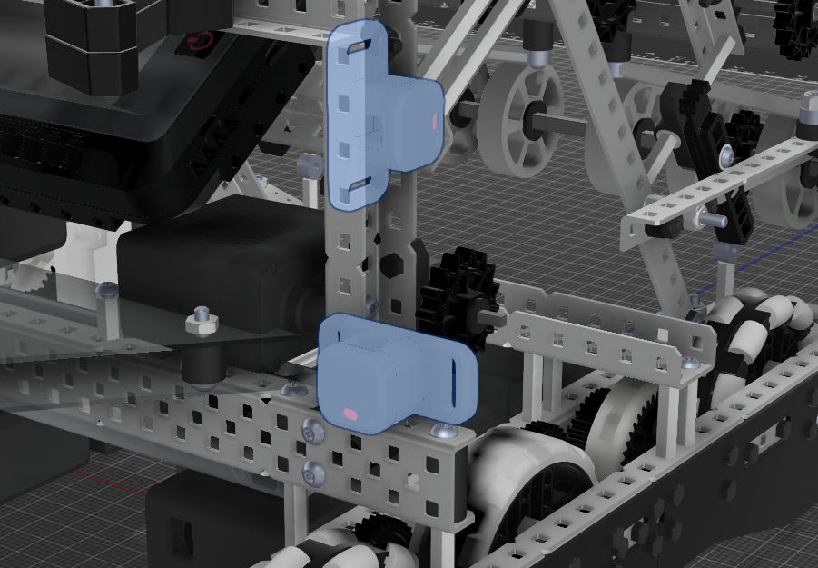
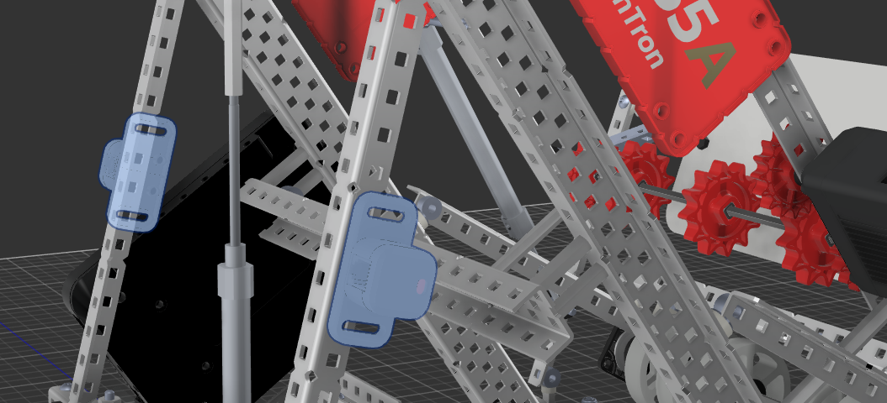
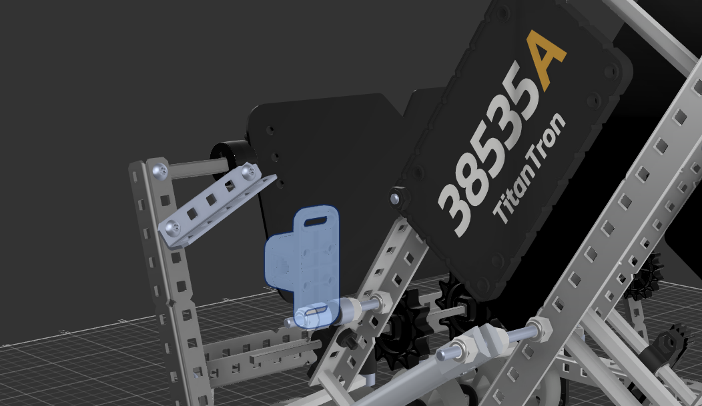
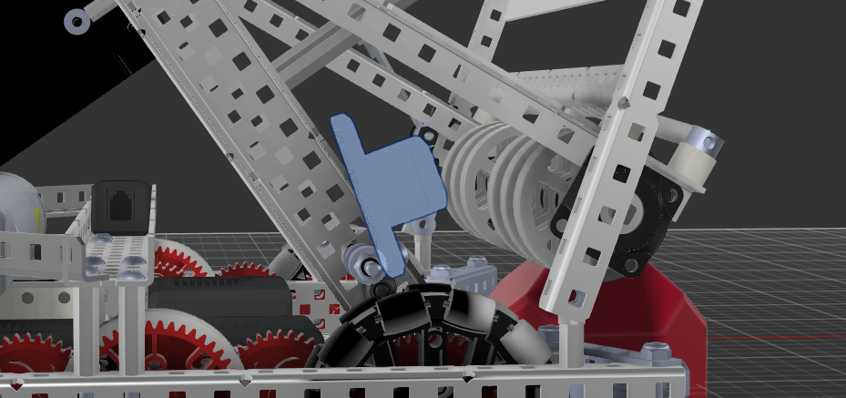
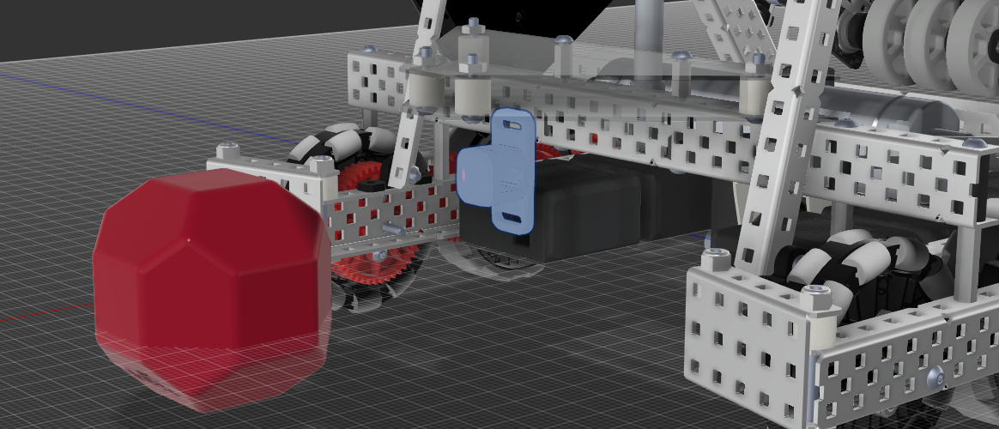
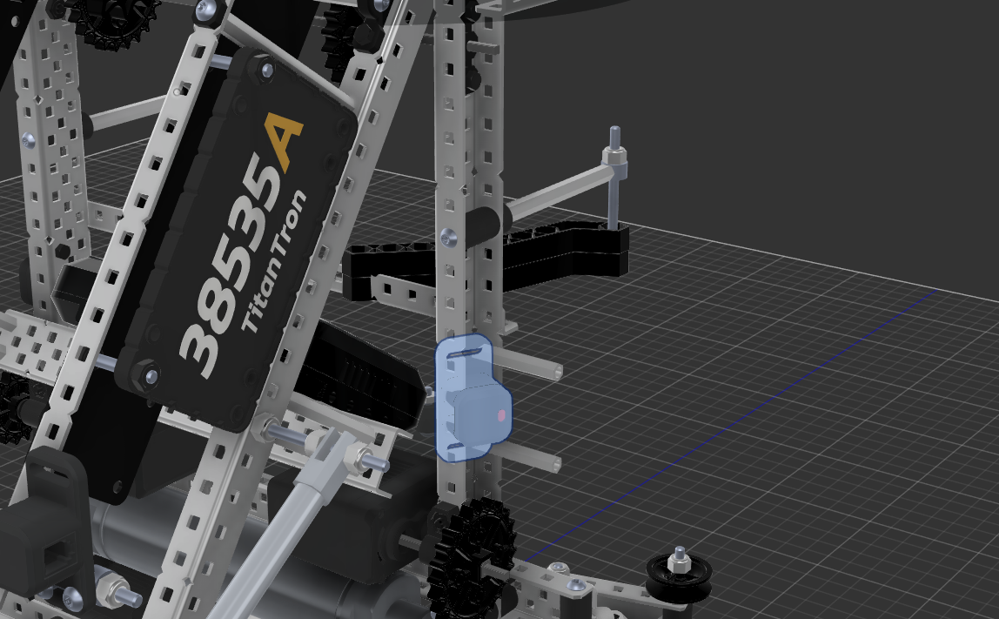
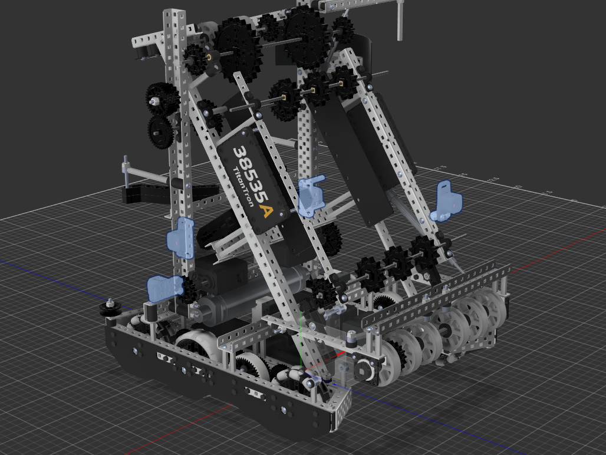
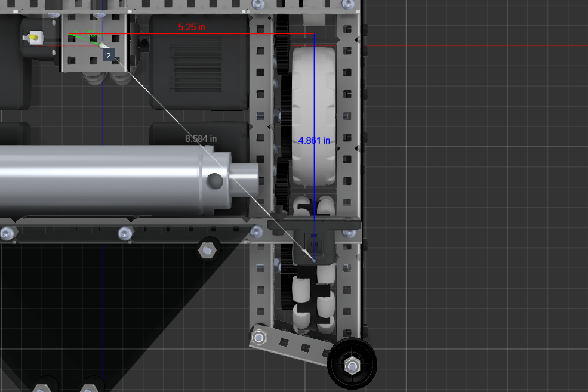
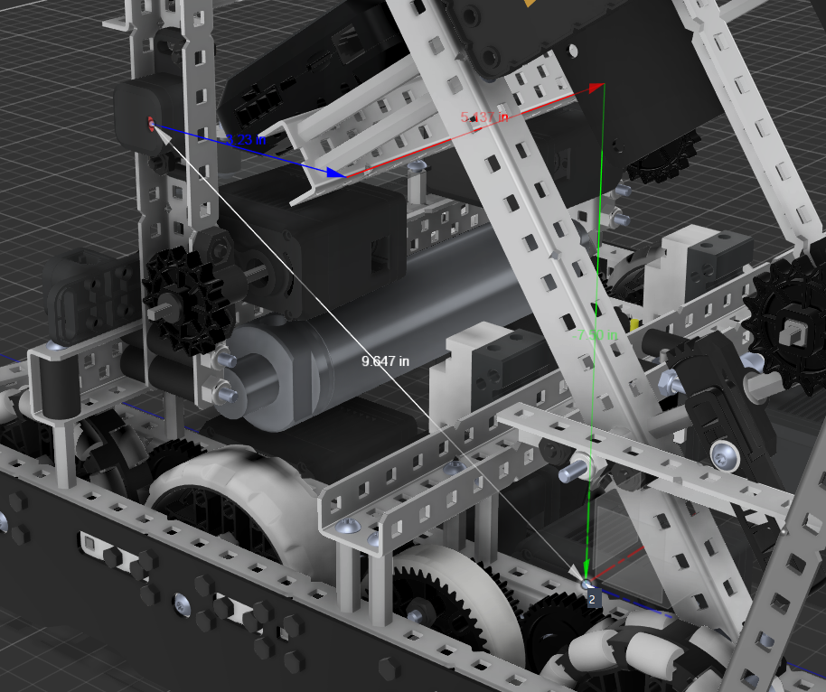
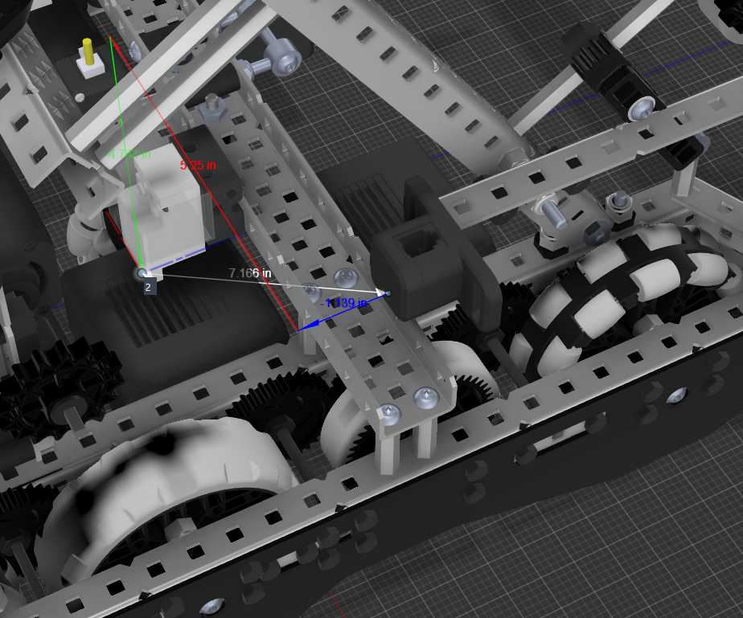

# TitanReset - Physical Setup

## Mounting the V5 Distance sensors

This section goes over the physical setup of the distance sensors on your robot for TitanReset.

**Sensors are referred to by thier cardinal directions.**
 - North -> Front
 - East -> Left
 - South -> Rear
 - West -> Right

### Materials Needed  
 - 4x V5 Distance Sensor
 - Ruler

### Sensor Locations

Sensors need to be located on every side of the robot, with one sensor on every side. This means there needs to be a sensor on the Front, Right, Rear, and Left of your robot. **The sensors also need to meet the following requirements to work properly**:

 - Square to the robot - Sensors cannot be tilted or turned in any way that effects how will see distances. Imagine a line coming out of the sensor **(This is called the LINE OF SIGHT of the sensor)**, that line needs to be parrallel with the ground and parrallel to your robot in the direction it faces.

 - Unobstructed - The sensors line of sight cannot be obstructed by either the robot or game/field elements. This means that the sensor has to be high enough to not be interefered with by game elements and also not experience interference by robot mechanisms.

 - (Optional & Optimal) Works with metal fields - To have the sensors work with the metal fields, the sensors have to mounted in a way that causes them to hit the metal bar at the top of the field and not the polycarbonate walls.

### Pictures and descriptions

#### Valid Mounts

These sensors mounts are **valid** for the following reasons:

 - Sensors are square to the robot (and therefore the line of sight)
 - Sensors are high enough to not interfere with the robot or game elements

These sensor mounts are **valid** even though they are tilted for the following reasons:

 - Line of sight is square to the robot
 - Sensors do not interfere with the robot or game elements.

This sensor mount is **valid** for the following reasons:

 - Line of sight is square to the robot
 - Sensor does not interfere with the robot typically. It could technically interefere with the match loader mechanism, but this varaible can be controlled making it a valid mount.

#### Invalid Mounts

This sensor mount is **invalid** even though it is unobstructed for the following reasons:

 - The sensors line of sight is **not square** to the robot.

This sensor mount is **invalid** even though it is square to the robot for the following reasons:

 - The sensors line of sight could be **obstructed** by game elements on the field, making the readings untrustworthy, therefore defeating the point of DSR

 

This sensor mount is **invalid** even though it is unobstructed for the following reasons:

 - The sensors line of sight is **not square** to the robot.

#### Completed example with 4 sensors

## Sensor Offsets

To make the sensors accurate, you need to find the **perpendicular (X) and parrallel (Y)** offsets of the sensors of your robot.

These are calculated from the origin to the **sensors camera**. **The origin is the center of your robot**

The parrallel offset refers to the offset from the origin in the direction the sensor is facing.

The perpendicular offset refers to the offset from the origin 90 degrees from the direction the sensor is facing.

The offset of the sensor from the ground is irrelevant to calculations and therefore not factored in.

##### These values will almost always be positive, unless the sensors are past the origin.

Since this language might seem hard, here is a visualization of the offsets:

What this picture is showing:
 - The **blue line** is the parrallel offset of the sensor, since it is in the same direction the sensor is facing. This means the parrallel (X) offset is 4.861 inches.
 - The **red line** is the perpendicular offset of the sensor, since it is in a right angle of the direction the sensor is facing. This means the perpendicular (Y) offset is 5.25 inches.
 - For this robot, the odometry is in the origin of the robot, but that might not be the case for your robot.

The offset of this sensor would be: `X: 4.861, Y: 5.25`.

##### Another Example

The offsets for this sensor would be `X: 5.137, Y: 3.23`.

The X (parrallel) offset would be **red** line in this case since it is parrallel to the direction the sensor is facing

The Y (perpendicular) offset would be the **blue** line since this line is 90 degrees to the sensor the direction is facing

##### Negative Offset Example

The offsets for this sensor would be `X: -1.139, Y: 5.25`.

The X (parrallel) offset of this sensor would be negative since it is past the origin in the opposite direction of what it is facing.

### Collect all of your offsets

Collect all of your offsets for each sensor. Write them down or store then somewhere you can access later.

**When measuring your offsets, measure from the camera of the sensor**

**When storing your offsets, store the parrallel offset as X and the perpendicular offset as Y**

##### Collected Offsets Example (Matches above except for negative example)

 - North `X: 5.823, Y: -4.694`
 - East `X: 5.137, Y: 3.23`
 - South `X: 4.861, Y: 5.25`
 - West `X: 5.127, Y: 3.744`

## Physical Setup Complete!

You just completed the hard part of TitanReset! Learn how to program your new sensors with TitanReset to improve your autons [here]()

