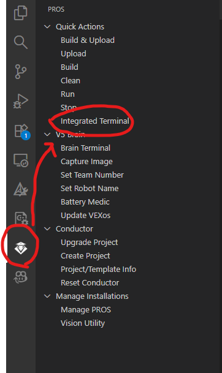
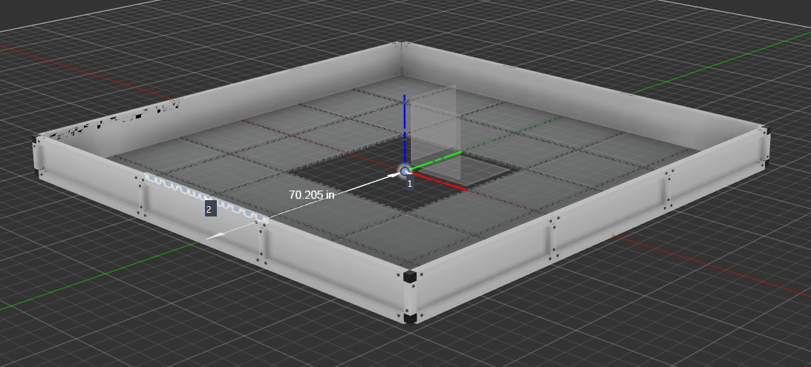
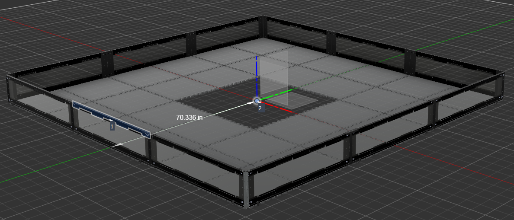

# TitanReset - Programming Setup Tutorial

## TitanReset - Setup

This section goes over how to setup TitanReset specifically. This will not go over LemLib setup and will assume that either is already setup for your robot.

**If you need help setting up LemLib**, I suggest the following resource:
 - [LemLib Setup (Website)](https://lemlib.readthedocs.io/en/stable/tutorials/1_getting_started.html)

## Installation

To begin using TitanReset, you first need to install it. This can be done through the command line and the pros conductor.

First, you should click the pros icon on the sidebar of Visual Studio Code and from there press the integrated terminal button. After that a terminal should appear **on the bottom** of Visual Studio Code.



After that, run the following commands in order to **install TitanReset**.

> [!NOTE]
> **TitanReset ONLY SUPPORTS PROS V2.4.1+** 

#### Install Commands

```pros c add-depot TitanReset https://raw.githubusercontent.com/tubaplayerdis/TitanReset/refs/heads/main/depot.json```

```pros c apply TitanReset@0.0.3```

## Programming Setup

> [!NOTE]
> You do not literally have to paste the all of the following code into `main.cpp`. This guide assume that you have your template objects defined in main.cpp,
> **If your LemLib objects are defined somewhere else, use the file that contains those definitions instead.**

### Adding TitanReset to your file

After that, include TitanReset into your `main.cpp` file.

```cpp
#include "TitanReset/TitanReset.hpp"
```

### Setting Up Distance Sensors

Next, paste the following code into your `main.cpp` file.

```cpp
/**
 * North sensor
 * X is your parrallel offset
 * Y is your perpendicular offset
 * P is the port of your sensor
 */
tr_sensor north({X, Y}, P);

/**
 * East sensor
 * X is your parrallel offset
 * Y is your perpendicular offset
 * P is the port of your sensor
 */
tr_sensor east({X, Y}, P);

/**
 * South sensor
 * X is your parrallel offset
 * Y is your perpendicular offset
 * P is the port of your sensor
 */
tr_sensor south({X, Y}, P);

/**
 * West sensor
 * X is your parrallel offset
 * Y is your perpendicular offset
 * P is the port of your sensor
 */
tr_sensor west({X, Y}, P);
```

#### Populate the X,Y, and P objects with the offsets you measured in the [previous tutorial](PhysicalSetup.MD).

 - The X value if the parrallel offset for that sensor
 - The Y value is the perpendicular offset for that sensor
 - The P value is the port of that sensor

#### Completed Example (matches the previous tutorial)

```cpp
/**
 * North sensor
 * X is your parrallel offset
 * Y is your perpendicular offset
 * P is the port of your sensor
 */
tr_sensor north({5.823, -4.694}, 10);

/**
 * East sensor
 * X is your parrallel offset
 * Y is your perpendicular offset
 * P is the port of your sensor
 */
tr_sensor east({5.137, 3.23}, 11);

/**
 * South sensor
 * X is your parrallel offset
 * Y is your perpendicular offset
 * P is the port of your sensor
 */
tr_sensor south({4.861, 5.25}, 12);

/**
 * West sensor
 * X is your parrallel offset
 * Y is your perpendicular offset
 * P is the port of your sensor
 */
tr_sensor west({5.137, 3.744}, 13);
```

### Setting up your TitanReset chassis

To make all the sensors work together, you have to setup a TitanReset chassis. Keep this in the same place as your `tr_sensor` objects.

Paste the following code into your `main.cpp` file to setup the TitanReset chassis:

```cpp
/**
 * TitanReset Chassis
 * &imu - pointer to IMU
 * &chassis - pointer to LemLib chassis
 * {&north, &east, &south, &west} - Array of pointers to sensors.
 */
tr_chassis dsr_system(&imu, &chassis, {&north, &east, &south, &west});
```
Notes:
 - If your imu object or lemlib chassis object are named something else, change the parameter names to match the name of the chassis or imu. (default called chassis & imu)

### Optional (But Highly Recommended) - Field Perimeter Differences

In V5RC, there are two different V5RC legal field perimeters

 - Legacy Metal Field Perimeter
 - V5 Plastic GPS Field Perimeter

As with lots of things vex, theses perimeters have 2 different radiuses and these changes are also undocumented!

To support this discrepancy, there is an optional parameter at the end of the tr_chassis which allows TitanReset to accomodate for the difference.

This parameter defaults to the plastic field perimeter due to its higher relevance in V5RC competitions.

#### Visualization of the difference

##### V5 Plastic Field



##### Legacy Metal Field



When using **metal fields** it is highly recommended to append this to the end of the tr_chassis constructor to make TitanReset more accurate:

```cpp
/**
 * TitanReset Chassis
 * &imu - pointer to IMU
 * &chassis - pointer to LemLib chassis
 * {&north, &east, &south, &west} - Array of pointers to sensors.
 * Using the metal field perimeter
 */
tr_chassis dsr_system(&imu, &chassis, {&north, &east, &south, &west}, tr_fields::metal);
```

## Thats all for setup!

Read the [next tutorial](ProgrammingUsage.MD) on how to accurately and reliably use DSR in your autons!
