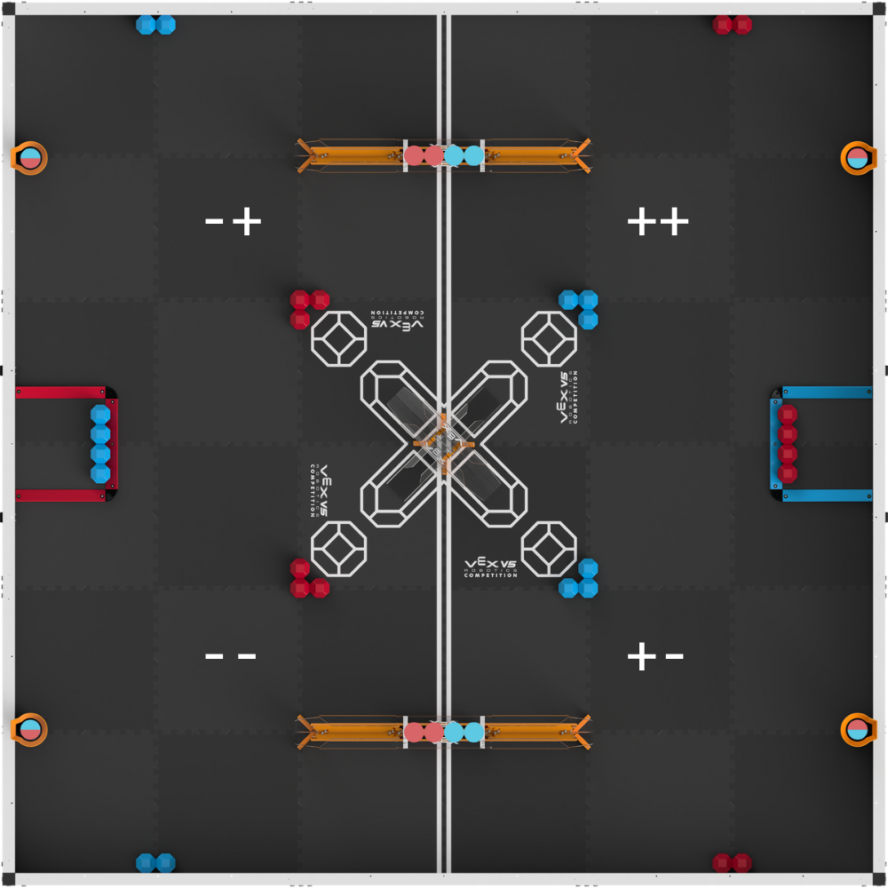
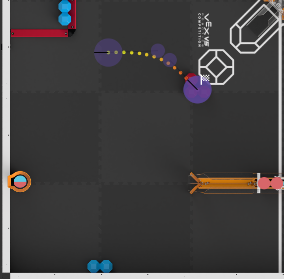

# TitanReset - Programming Usage Tutorial

This tutorial will go over the best practices and usage of TitanReset.

## Intoroduction - Coordinates, JerryIO, etc

#### Notice - This assumes you are using coordinates to create autonomous routines as is standard pracice with LemLib and EZ-Template

#### TitanReset is a DSR implementation.

Just the like VEX GPS Sensor, DSR (Distance Sensor Reset) is based off absolute positioning. This is done since it is too convoluted to have DSR be based off of other coordinate systems.

Most autonomous routines absent of DSR or GPS use local coordinates. This means the positioning is based of where the robot starts. This is opposite to system used by DSR.

TitanReset (DSR) uses absolute potitioning, this means that the coordinates are based off the center of the field and not where the robot starts.

### Your new best friend - [JerryIO](path.jerryio.com)

The coordinate system used by TitanReset is the same as the VEX Game Posititing System. Since JerryIO also supports this positioning system, it is in your best intrest to use JerryIO in the aid of the construction of your autons.

> [!NOTE]
> Make sure your coordinate system is set to the `VEX Gaming Positioning System`. This is the coordinate system TitanReset uses

### Quadants

TitanReset uses alot of refrences to quadrants. This is representative of qudrants of the field. The quadrants are as follows in the picture below.



## Starting location

When using DSR, it is best practice to start your autons with a call to the DSR system to improve consistency. TitanReset provides this functionality with the following function:

```cpp
void perform_dsr_init(tr_quadrant quadrant, float heading);
```

This function tells the TitanReset two things so that it performs an accurate distance sensor reset:
 - `quadrant` - This is the quadrant the robot is currently in. This is important so TitanReset knows which sensors to use.
 - `heading` - This is the heading of the robot when it starts the auton. This is also critical as TitanReset uses this so know which sensors to use. **This function will set the heading of the chassis and imu based on the input**. If you already set the heading of the robot, input the robots current heading into the heading parameter.

#### You should use this function to START your autons. Heres what this would look like:

Context of this example
 - dsr_system is the object name of tr_chasis object

```cpp
void super_auton()
{
    /*
    * The robot is in the -- quadrant
    * The robot is facing 270 degrees
    */
    dsr_system.perform_dsr_init(tr_quadrant::NEG_NEG, 270);

    //Rest of the auton
}
```

This example sets the location of the robot by telling it the quadrant it is currently in and the heading the bot is at. After this function is called the following will happen:
 - The location of the robot will be set
 - The heading of the robot will be set

## Using DSR during auton

> [!NOTE]
> DSR can only be used when 2 different walls are being sensed by the sensors. if the revelant sensors (closest to wall) read the same wall, the readings will be wrong.

An example of this would be using DSR while in the middle of the field tilted at 45 degrees. This would almost always result in the sensors reading the same wall and causing the readings to be incorrect.

> [!NOTE]
> When using DSR, make sure the relevant sensors (closest to the walls) are unobstructed after the movement before using DSR, otherwise it will cause major inconsistencies

An example of this would be using DSR while at the middle goal, which would most likey result in incorrect reading.

### When to use DSR

 - **When close to the walls**
 - Heading is at a right angle
 - Starting an auton
 - After movements that cause drift
    - swingToHeading
    - moveToPose

### When not to use DSR

 - **When close to the center of the field**
 - After every movement
 - When the sensors could read wrong consistently
    - Obstruction by game elements


## Relevant Functions

TitanReset provides a different functions for using DSR after starting an auton. Here is a description of these functions below:

```cpp
bool perform_dsr(bool trust_sensors = false);
```

#### This is the best general use DSR function, and should be used in most cases.

```cpp
bool perform_dsr_quad(tr_quadrant quadrant, bool trust_sensors = false);
```

#### This function should be used an alternative to perform_dsr(), when you are unsure of which quadrant the robot is in (such as a parking zone cross)


## Using JerryIO to create autons

Since TitanReset uses absolute coordinates, you can use [JerryIO](path.jerryio.com) to plan your movmements. Following with the example above, is an example movement showing the power of TitanReset and jerryIO.

> [!NOTE]
> Make sure your coordinate system is set to the `VEX Gaming Positioning System`. This is the coordinate system TitanReset uses

Here is an example movement in JerryIO:



The coordinates of the point in the example movement are: `-22, -23, 315`

Heres what this would look like in code:

##### Example uses LemLib. This would look different in EZ-Template

```cpp
void super_auton()
{
    /*
    * The robot is in the -- quadrant
    * The robot is facing 270 degrees
    */
    dsr_system.perform_dsr_init(tr_quadrant::NEG_NEG, 270);

    /*
    * Move to the point in the example from the JerryIO coordinates
    * Default settings
    * Syncronous (waiting) function
    */
    chassis.moveToPose(-22, -23, 315, 1000, {}, false)
}
```